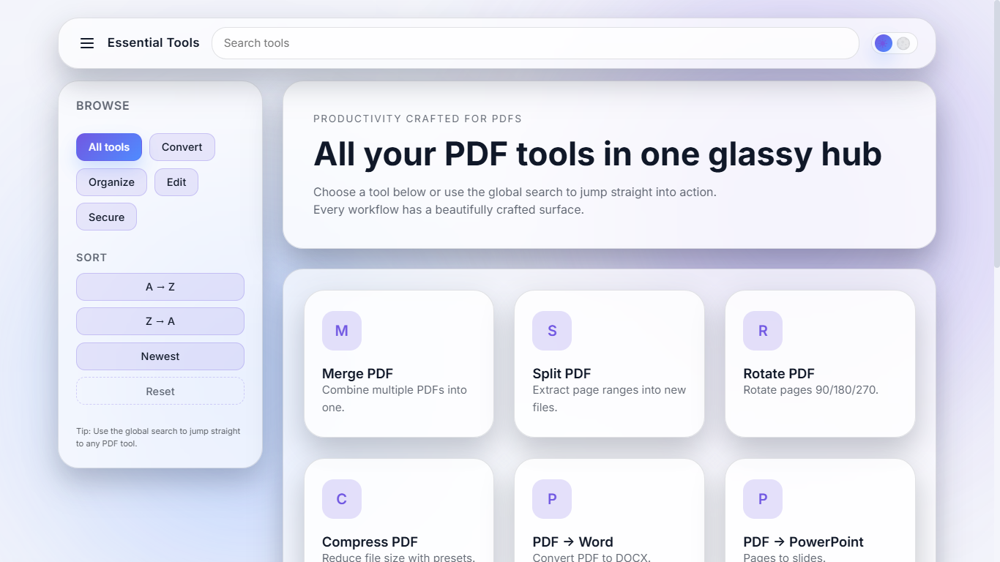
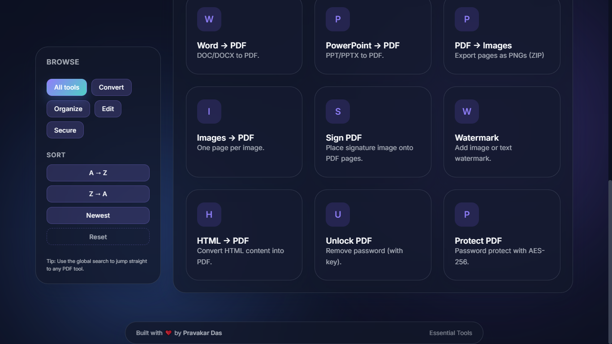
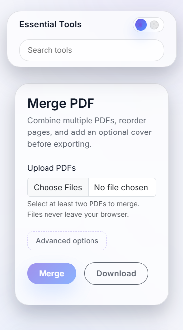

# Essential Tools (Flask)

<!-- Badges -->

  
  
  
  
  

Modern, local‑first PDF utilities built with Flask and a glassmorphic UI. Merge, split, rotate, compress, convert, sign, watermark, protect and more — all wrapped in a clean API and a responsive, dark/light themed interface.

⚠️ Note: This project is a personal endeavor created for portfolio purposes and is not associated with any real business or project.

## Highlights

- Elegant UI with glass/transparency, dark/light mode, and keyboard‑friendly controls
- Local‑first processing where possible (PyMuPDF/Pillow/pdf-lib)
- Background jobs with a simple filesystem job store (optionally RQ/Redis)
- Signed, one‑time download URLs for generated artifacts
- REST endpoints so the UI and API can be used independently

## Implemented Tools

- Organize
  - Merge PDF
  - Split PDF (by ranges)
  - Rotate PDF (page scope support)
- Optimize
  - Compress PDF (Ghostscript, qpdf, or pure rewrite fallback)
- Convert
  - PDF → Word (pdf2docx)
  - Word → PDF (LibreOffice if available; DOCX fallback via PyMuPDF text rendering)
  - PDF → PowerPoint (PyMuPDF + python‑pptx)
  - PowerPoint → PDF (LibreOffice or Windows PowerPoint COM; otherwise suggest saving as PPTX)
  - PDF → Images (PNG per page; ZIP bundle)
  - Images → PDF (img2pdf with Pillow fallback)
  - HTML → PDF (WeasyPrint if available; robust PyMuPDF fallback)
- Edit / Secure
  - Sign PDF (optional background removal on PNG signatures)
  - Watermark (image or text; diagonal, tiled, full‑page styles)
  - Protect PDF with password (AES‑256 via PyMuPDF)

## Screenshots

| 

 |  |

## Tech Stack

- Backend: Flask, PyMuPDF (fitz), pypdf, Pillow, img2pdf, pdf2docx, python‑pptx
- Optional system tools: LibreOffice, Ghostscript, qpdf (used when present)
- UI: Jinja templates + Bootstrap 5, custom CSS, minimal JS
- Jobs: In‑process ThreadPool by default, optional RQ/Redis

## Quick Start

1) Create and activate a virtual environment

    # Windows
      `python -m venv venv`
      `venv\Scripts\activate`  

    # macOS/Linux
    `source venv/bin/activate`

2) Install dependencies `pip install -r requirements.txt`

3) Run the development server
  `python run.py`

4) Visit the app: http://127.0.0.1:5000

Optional native tools that improve results for some features:

- LibreOffice (enables high‑fidelity Word/PowerPoint conversions)
- Ghostscript and/or qpdf (improves compression results)

The app gracefully falls back to pure‑Python implementations when these are unavailable.

## Platform Notes

- HTML → PDF: WeasyPrint provides full HTML/CSS rendering but requires GTK on Windows. If it isn’t available, the app uses a PyMuPDF text renderer automatically — no crash, no startup warnings.
- Word/PowerPoint conversions: LibreOffice (if on PATH) is preferred for fidelity. On Windows, PowerPoint COM is used as an additional PPTX→PDF option. Pure‑Python fallbacks are included for common cases.

## Development Tips

- Toggle dark/light in the header; the theme is persisted in localStorage.
- Tool surfaces are plain Jinja templates under 	emplates/tools/ — use the surface and surface--panel classes to match the glass UI.
- To add a new tool:
  1. Create a module in models/tools/ exposing process(job, upload_paths).
  2. Register it in models/tools/__init__.py.
  3. Add a template in 	emplates/tools/<slug>.html.

## License / Usage

This repository is provided for educational and portfolio purposes. You’re welcome to fork and experiment locally. For production use, audit each processor and configure a production‑grade WSGI server and background worker.

---

If you spot an edge case or want an additional tool, feel free to open a discussion or PR! (pravakar459@gmail.com)
